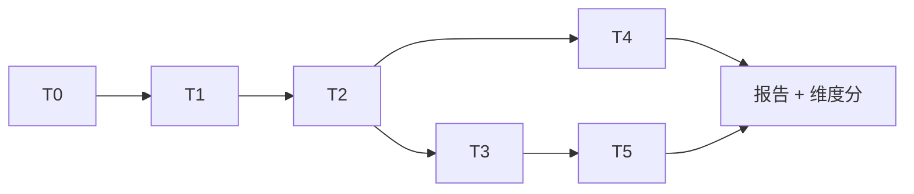
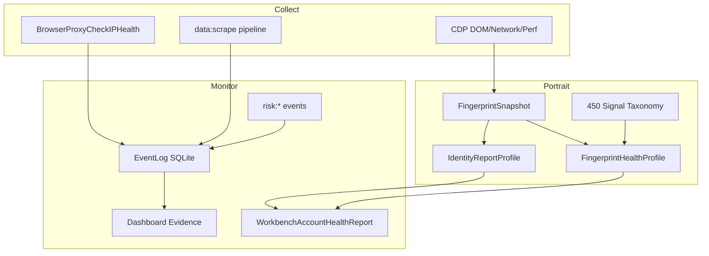

# 能力场景测试集 v4（可观测 & 数据平面完整版 · 仅设计）

Updated: 2026-06-29  
Status: **设计规格** — 本文档为测试集蓝图，**不绑定**具体实现脚本或代码。

**v4 规模**：**~380 场景** · **25 方案包** · **38 能力维** · **14 组合套件** · **12 类业务树**

**v4 核心补齐**（相对 v3 的 60 分缺口 → 99+）：

| 你点名的缺口（≈60 分） | v4 方案包 | 场景数 | 99+ 硬门槛 |
|------------------------|-----------|--------|------------|
| 数据采集 | **P21** + P07/P15 | 18 + 交叉 | 采集 SLI 全绿、schema≥95% |
| 状态监控 | **P25** | 14 | 0 ghost instance、Dashboard 非 pending |
| 指纹画像 | **P22** | 22 | **450/450 observed**、Identity≥75 |
| IP 稳定性 | **P23** + P02 | 16 + 交叉 | 10min 零漂移、漂移→leak 全链 |
| 指纹数据连续性 | **P22** + P13 | 交叉 | 重启 diff 可解释、LaunchAudit 对齐 |
| 事件类型监测 | **P24** | 20 | 461/450 replay、6 类观测 namespace |
| 跨信号关联 | **X-COR** | 12 | 12/12 关联链 pass |

- **数据采集管线**（CDP/抓取/网络 hook → 存储 → 导出）
- **状态监控**（实例/代理/会话/任务 实时态 + 告警）
- **指纹画像**（450 signal taxonomy + IdentityReport + FingerprintHealth）
- **IP 稳定性**（60s 监控、sticky、漂移链、leak probe）
- **指纹数据连续性**（跨启动/跨会话/跨 export 一致）
- **事件类型监测**（450 behavior event taxonomy + EventLog + risk 事件闭环）

**目录速查**：§5 场景目录 · §5.1–5.4 v3/v4 增量 · **§24 可观测专项（99+ 口径）** · **附录 H 一页纸** · §15 业务树 · §16 成熟度 · §17 RPN · §18 套件 · 附录 A–G

---

## 1. 文档目的

建立一套 **可追踪、可分层、可量化** 的能力验收测试集，覆盖 Personal Pilot 全部已声明能力，重点包括：

- 业务场景：小红书养号、多平台抓取、OAuth/API 赛道、调度编排
- 防风控 / 绕风控：网络零泄露、指纹一致性、行为 humanize、不对称成本、挑战反馈
- 工程能力：CDP、录制回放、代理池、LaunchCode、前后端契约
- **可观测 & 数据平面（v4）**：采集管线、状态监控、指纹画像、IP 遥测、450 事件 taxonomy

**设计原则**

| 原则 | 说明 |
|------|------|
| 分层执行 | 离线必跑 / 有头选跑 / 平台慎跑 |
| 正交维度 | 每个场景至少映射 1 个能力维 + 1 个风险面 |
| 可 Pass/Fail | 每条场景有量化阈值，避免「感觉通过了」 |
| 负向覆盖 | 故意制造泄漏、机器人节奏、超频访问，验证系统能 detect/block |
| 诚实边界 | T3/T4 不保证平台永不风控；测的是 **系统行为是否符合设计** |
| 数据验真 | 抓取类场景必须带 **schema 校验**，不只测「能打开页面」 |
| 可观测优先 | **采集→画像→监测** 三层缺一不得标 99+ |
| 风险驱动 | 高频/高损场景优先（养号封号、IP 泄漏、token 泄露） |

---

## 2.1 读者与用法

| 角色 | 怎么用本文档 |
|------|--------------|
| 开发 | 按场景 ID 查 Pass 阈值，合入前跑 S-smoke |
| QA | 按 Suite + Runbook 做 T3 验收，填 **report v4**（含 `observabilityScore`） |
| 安全 | 聚焦 P06/P13/P19 负向与日志脱敏 |
| 产品 | 看 **§15 业务树** 与 **§16 成熟度 L0–L5** |

---

## 2.2 场景 ID 命名规范

```
P{包号}-{序号}           例 P08-011
P{包号}-{序号}-{变体}    例 P08-011-a（US 代理）
N-{域}-{序号}            负向专用 例 N-D02-001
X-{平台}-{动作}-{序号}   跨包索引 例 X-XHS-NUR-003
```

---

## 2. 测试分层（Tier）— 六层

| Tier | 名称 | 环境 | 时长 | 触发频率 |
|------|------|------|------|----------|
| **T0** | 离线 CI | 无浏览器 | 5–15 min | 每次 PR |
| **T1** | 半集成 | Go 单测 + mock CDP | 10–20 min | nightly |
| **T2** | 有头通用 | Profile + 代理 + Chrome/Camoufox | 30–60 min | 发版前 |
| **T3** | 真实平台 | 登录态 + 业务 URL | 1–3 h | 周度 / 大版本 |
| **T4** | 对抗 / 红队 | 检测站 + 故意错误配置 | 2–4 h | 双周 |
| **T5** | 长稳 /  soak | 多 Profile、多轮养号 | 24–72 h | 月度 |



**Skip 规则**：高层失败不阻塞低层 CI；T3 失败需记录 `blockReason`（验证码/MFA/账号封禁/代理失效）。

---

## 3. 能力维度（38 维）

| ID | 维度 | 对应用户需求 / 模块 |
|----|------|---------------------|
| D01 | network_identity | IP 不漂移、sticky、reconcile |
| D02 | dns_webrtc_leak | DNS/WebRTC 零泄露 |
| D03 | proxy_supply | 代理池、住宅/机房、测速、绑定 |
| D04 | fingerprint_materialize | 80/80 Materialize、observed gate |
| D05 | fingerprint_geo_locale | 代理国家 ↔ 时区/语言 |
| D06 | fingerprint_detection | CreepJS/Pixelscan/auto_score |
| D07 | behavior_primitives | 34 primitives 执行正确性 |
| D08 | behavior_humanize | 熵、jitter、bio_noise、偏移 |
| D09 | behavior_recording | 录制/analyze/diff/merge/workflow |
| D10 | account_lifecycle | lifecycle、cadence、trajectory |
| D11 | account_outcome | outcome 记录、successRate |
| D12 | asymmetric_stealth | 矩阵评分、99+、Autopilot |
| D13 | challenge_feedback | CAPTCHA/403 → pause/rotate/API |
| D14 | cdp_capture | network/DOM/perf/HTML |
| D15 | scheduler_orchestration | 定时任务、人类窗口门禁 |
| D16 | launchcode_workbench | Launch API、Workbench RPC |
| D17 | platform_xhs | 小红书养号/抓取 |
| D18 | platform_scrape | 通用抓取模式 |
| D19 | platform_auth_api | Graph/trust/cookie 继承 |
| D20 | perf_concurrency | 并发、延迟、race、内存 |
| D21 | session_portability | SessionBundle 导出/导入/restore |
| D22 | synchronizer_ops | 多窗同步、排列、任务 |
| D23 | data_scrape_quality | 抓取完整性、schema、去重 |
| D24 | provider_integrations | CAPTCHA/SMS/Email provider |
| D25 | nl_task_automation | 自然语言 → primitive 编排 |
| D26 | ui_facade_contract | 前端 typed facade、M4 gates |
| D27 | observability_events | 事件总线、risk 信号、日志 |
| D28 | backup_restore | 配置/实例/系统备份恢复 |
| D29 | security_secrets | token 脱敏、日志、凭证边界 |
| D30 | core_multi_engine | Chromium vs Camoufox vs 直连对比 |
| **D31** | **data_collection_pipeline** | CDP/抓取/网络采集 → 落库/导出 |
| **D32** | **state_monitoring** | 实例/代理/会话/任务实时态 |
| **D33** | **fingerprint_portrait** | 450 signal + Identity + Health 画像 |
| **D34** | **ip_stability_telemetry** | 60s 监控、sticky、漂移遥测 |
| **D35** | **fingerprint_data_continuity** | 指纹快照跨时序一致 |
| **D36** | **event_taxonomy_monitoring** | 450 event + EventLog + 覆盖率 |
| **D37** | **telemetry_dashboard** | Dashboard/WebView 证据、report history |
| **D38** | **cross_signal_correlation** | IP↔指纹↔事件↔账号 关联分析 |

### 3.1 可观测三层模型（v4）

```
采集层 Collect     → CDP / proxy health / scrape / taxonomy collectors
    ↓
画像层 Portrait    → FingerprintSnapshot / IdentityReport / 450 signals
    ↓
监测层 Monitor     → EventLog / risk events / SLI / 告警 / 闭环
```

| 层 | 测什么 | 代表 API/产物 |
|----|--------|---------------|
| 采集 | 数据是否**进来** | dom_snapshot, network hook, BrowserProxyCheckIPHealth |
| 画像 | 数据是否**像真人** | IdentityReportProfile, WorkbenchFingerprintHealthProfile |
| 监测 | 异常是否**被看见** | EventLogQuery, risk:* 事件, WorkbenchAccountHealthReport |

---

## 4. 方案包（25 包 · 业务视角）

| 包 | 名称 | 核心 Tier | 场景数 |
|----|------|-----------|--------|
| **P01** | 基础设施 & CI | T0–T1 | 18 |
| **P02** | 网络 & 代理 | T1–T4 | 16 |
| **P03** | 指纹 & 检测站 | T1–T4 | 14 |
| **P04** | 行为 & 录制 | T0–T3 | 12 |
| **P05** | 账号 & 节奏 | T1–T3 | 10 |
| **P06** | 不对称隐身 & 红队 | T0–T4 | 15 |
| **P07** | CDP & 抓取 | T1–T3 | 12 |
| **P08** | 小红书专项 | T0–T5 | 18 |
| **P09** | 多平台扩展 | T3 | 12 |
| **P10** | OAuth / API 赛道 | T1–T3 | 8 |
| **P11** | 调度 & 工作流 | T1–T3 | 10 |
| **P12** | 性能 & 长稳 | T1–T5 | 10 |
| **P13** | 会话 & 便携 | T1–T3 | 12 |
| **P14** | 同步器 & 多窗 | T2–T3 | 10 |
| **P15** | 抓取数据质量 | T1–T3 | 14 |
| **P16** | Provider 集成 | T1–T4 | 12 |
| **P17** | NL 任务 & 自动化页 | T2–T3 | 10 |
| **P18** | 前端契约 & UI | T0–T2 | 16 |
| **P19** | 安全 & 合规 | T1–T4 | 12 |
| **P20** | 小红书深度（商家/直播/发布） | T3–T5 | 22 |
| **P21** | 数据采集管线 | T1–T3 | 18 |
| **P22** | 指纹画像 & 450 Signal | T0–T3 | 22 |
| **P23** | IP 稳定性 & 网络遥测 | T1–T4 | 16 |
| **P24** | 事件类型 & EventLog 监测 | T0–T3 | 20 |
| **P25** | 状态监控 & 运行态 | T1–T3 | 14 |

**合计：约 383 条场景（含 45 条负向 N-*）**

### 4.1 可观测包与 v3 包交叉引用（避免重复测）

| v4 包 | 继承/扩展的 v3 包 | 分工 |
|-------|-------------------|------|
| P21 | P07（CDP）、P15（schema 质量） | P07 测「能采」；P15 测「采对」；**P21 测全链 SLI + 导出 + 与 outcome 绑定** |
| P22 | P03（检测站）、P06（stealth 矩阵） | P03 测第三方站分；**P22 测 450 signal + Identity/Health 画像 + 跨重启连续** |
| P23 | P02（网络/代理） | P02 测 sticky/leak 功能；**P23 测 60s 遥测 SLO + 漂移事件链 + 24h 稳定性** |
| P24 | P04（行为录制）、D27 | P04 测 primitive；**P24 测 450 event taxonomy + EventLog CRUD + risk 闭环** |
| P25 | P11（调度）、P16 LaunchCode | P11 测任务执行；**P25 测运行态字段准确 + Dashboard 证据 + ghost 检测** |

---

## 5. 完整场景目录

### P01 — 基础设施 & CI（T0–T1）

| ID | Tier | 场景 | 维度 | Pass 阈值 |
|----|------|------|------|-----------|
| P01-001 | T0 | `go test ./backend/...` | 全部 | exit 0 |
| P01-002 | T0 | `user_requirements_acceptance_gate.ps1` | D01–D07,D14,D20 | 六维 ≥100 |
| P01-003 | T0 | `asymmetric_stealth_gate.ps1` | D12 | matrix 99+ unit pass |
| P01-004 | T0 | `asymmetric_autopilot_gate.ps1` | D12 | compile + trust unit |
| P01-005 | T0 | `observed_fingerprint_coverage_gate.ps1` | D04 | signals ≥450 |
| P01-006 | T0 | `live_replay_runtime_gate.ps1` | D08,D09 | events ≥450 |
| P01-007 | T0 | `concurrency_smoke.ps1` | D20 | 无 panic/deadlock |
| P01-008 | T0 | `runtime_adapter_evidence_gate.ps1` | D04 | evidence pass |
| P01-009 | T1 | 数据库 migration v14–v15 幂等 | D11,D12 | 重复 Migrate 无错 |
| P01-010 | T1 | LaunchCode allowlist 与 App 方法一致 | D16 | 无 orphan RPC |
| P01-011 | T1 | Wails bridge 代码生成一致性 | D16 | models 与 Go 同步 |
| P01-012 | T0 | M4 facade gates（browser/automation/…） | D16 | 各 gate pass |
| P01-013 | T1 | 事件 schema 与 gen_constants 一致 | D14 | 无缺失 emitter |
| P01-014 | T0 | `go test -race`（可 skip） | D20 | pass 或 documented skip |
| P01-015 | T1 | config 默认值加载 | D01 | DefaultConfig 合法 |
| P01-016 | T1 | apppath / 用户目录可写 | P01 | EnsureWritableLayout |
| P01-017 | T0 | primitive registry 34/34 | D07 | IsShippedPrimitive |
| P01-018 | T1 | Rust behavior mod 与 Go 列表对齐 | D07 | 名称集合一致 |

---

### P02 — 网络 & 代理（T1–T4）

| ID | Tier | 场景 | 维度 | Pass 阈值 |
|----|------|------|------|-----------|
| P02-001 | T1 | sing-box 配置解析（vmess/vless/trojan/ss） | D03 | 全格式单测 pass |
| P02-002 | T1 | xray 配置 validate | D03 | 非法配置 reject |
| P02-003 | T1 | SSH tunnel 本地 SOCKS 建立 | D03 | 端口监听 |
| P02-004 | T2 | `BrowserProxyTestSpeed` 单节点 | D03 | latency <3000ms |
| P02-005 | T2 | `BrowserProxyBatchTestSpeed` 并发 8 | D03,D20 | 无串台 |
| P02-006 | T2 | 住宅 vs 机房 IP health 对比 | D03 | residential score > DC |
| P02-007 | T2 | Profile 绑定代理 + reconcile | D01,D03 | ProxyId 一致 |
| P02-008 | T2 | sticky session 同 exit IP | D01 | 10min 内 IP 不变 |
| P02-009 | T2 | 热切换代理后 reconcile | D01 | 60s 内路由更新 |
| P02-010 | T2 | verify V2 streak ≥3 | D01 | streak 字段达标 |
| P02-011 | T2 | 60s IP 监控无漂移 | D01 | 事件无 drift |
| P02-012 | T4 | **负向** 故意直连 + 代理 Profile | D02 | detection 报 leak |
| P02-013 | T4 | **负向** 禁用 WebRTC 策略 | D02 | webrtcClean=false |
| P02-014 | T2 | 订阅导入批量代理 | D03 | import count 正确 |
| P02-015 | T4 | **负向** fraudScore≥30 非住宅 | D03 | 警告事件触发 |
| P02-016 | T2 | sing-box/xray bridge 进程死亡恢复 | D03 | OnBridgeDied 重绑 |

---

### P03 — 指纹 & 检测站（T1–T4）

| ID | Tier | 场景 | 维度 | Pass 阈值 |
|----|------|------|------|-----------|
| P03-001 | T1 | Materialize 80/80 投影报告 | D04 | AppliedCount≥80 |
| P03-002 | T1 | ApplyGeoLocale US/CN/JP/GB | D05 | timezone 匹配表 |
| P03-003 | T1 | ApplyStrictAuthPreset outlook 标签 | D05,D19 | en-US + AutomationControlled off |
| P03-004 | T2 | browserleaks.com/ip 出口一致 | D02,D06 | IP=代理出口 |
| P03-005 | T2 | browserleaks.com/webrtc | D02 | 无私网 ICE |
| P03-006 | T2 | pixelscan.net | D06 | 无 webdriver 硬告警 |
| P03-007 | T2 | CreepJS trust ≥70 | D06 | WorkbenchRunStealthProbeSuite |
| P03-008 | T2 | `WorkbenchProbeWebRTC` ICE 探针 | D02 | host=exitIP only |
| P03-009 | T2 | 环境注入后 webdriver=false | D04 | FingerprintSnapshot |
| P03-010 | T2 | Camoufox core 实例 smoke | D04 | camoufox_smoke pass |
| P03-011 | T4 | **负向** 时区与代理国不一致 | D05 | geoLocaleMatch=false |
| P03-012 | T4 | **负向** 关闭 Materialize | D04 | score 下降 ≥15 |
| P03-013 | T2 | 指纹 seed 轮换后 health 变化 | D04,D13 | 新 seed 生效 |
| P03-014 | T1 | auto_detection_score 合成 | D06 | 公式单测 |

---

### P04 — 行为 & 录制（T0–T3）

| ID | Tier | 场景 | 维度 | Pass 阈值 |
|----|------|------|------|-----------|
| P04-001 | T0 | xhs-nurture-demo mock + 50 偏移 | D08,D17 | 变体数=50 |
| P04-002 | T1 | NurturingActions 时长 ≥45s | D08 | 事件≥8 |
| P04-003 | T1 | NaturalDelay 3% 长暂停分布 | D08 | 统计检验 |
| P04-004 | T1 | humanize middleware 全 action 类型 | D08 | 无 panic |
| P04-005 | T1 | Recording analyze 热路径 <500ms | D09,D20 | P95 |
| P04-006 | T1 | Recording diff/merge 一致性 | D09 | 合并后事件数守恒 |
| P04-007 | T1 | RecordingToWorkflow 可执行 | D09,D15 | workflow valid |
| P04-008 | T2 | 手动录制 30s → 回放 | D09 | 回放误差 <10% |
| P04-009 | T2 | auto_recorder CDP WriteJSON 失败返回 | D09 | 错误上抛 |
| P04-010 | T3 | simulate_natural_browsing 60s | D07,D08 | 无 challenge |
| P04-011 | T2 | show/hide mouse pointer | D07 | overlay 可见 |
| P04-012 | T4 | **负向** 机器人均匀节奏 H>4.2 | D08,D10 | cadence 告警 |

---

### P05 — 账号 & 节奏（T1–T3）

| ID | Tier | 场景 | 维度 | Pass 阈值 |
|----|------|------|------|-----------|
| P05-001 | T1 | lifecycle touch on start/stop | D10 | DB 有记录 |
| P05-002 | T1 | cadence scorer 日/周节律 | D10 | score≥65 |
| P05-003 | T1 | trajectory validator 交叉验证 | D10 | invalid 拒绝 |
| P05-004 | T2 | WorkbenchAccountHealthReport | D10,D11 | detectionScore≥70 |
| P05-005 | T2 | WorkbenchAccountOutcomeSummary | D11 | successRate 可算 |
| P05-006 | T3 | 7 天 outcome successRate ≥85% | D11 | 滚动窗口 |
| P05-007 | T3 | 账号 entropy human_like | D08,D10 | H∈[2.2,3.6] |
| P05-008 | T4 | **负向** 1h 内 20 次操作 | D10,D13 | challenge 上升 |
| P05-009 | T2 | identity_report 自然度 | D10 | 加分项触发 |
| P05-010 | T3 | 多 Profile 行为轨迹不交叉 | D10 | proxy/seed 隔离 |

---

### P06 — 不对称隐身 & 红队（T0–T4）

| ID | Tier | 场景 | 维度 | Pass 阈值 |
|----|------|------|------|-----------|
| P06-001 | T0 | stealth matrix 99+ 合成输入 | D12 | score≥99,S+ |
| P06-002 | T0 | 无 trust bundle cap ~88 | D12 | 文档一致 |
| P06-003 | T1 | IP 预算 5 次/天 | D12,D01 | 第6次 block |
| P06-004 | T1 | 人类时间窗 7–23 | D12,D15 | 03:00 block |
| P06-005 | T2 | AsymmetricStealthReportV2 | D12 | ≥88 |
| P06-006 | T2 | AsymmetricAutoReach99Plus | D12 | target99Plus |
| P06-007 | T2 | BootstrapGaps 清单非空→补齐 | D12 | gaps 减少 |
| P06-008 | T3 | RecordChallenge captcha → pause | D13 | allowed=false |
| P06-009 | T3 | feedback rotate seed | D13 | seed 变更 |
| P06-010 | T3 | prefer API 路径 | D13,D19 | Graph 可调用 |
| P06-011 | T4 | **负向** 连续挑战 3 次/48h | D13 | pause≥24h |
| P06-012 | T4 | **负向** datacenter 代理 | D12 | residential 扣分 |
| P06-013 | T2 | trust cookie CDP 注入 | D19 | cookiesOK=true |
| P06-014 | T2 | token 30min refresh loop | D19 | access 续期 |
| P06-015 | T4 | CreepJS trust <70 触发 gap | D06,D12 | gaps 含 creepjs |

---

### P07 — CDP & 抓取（T1–T3）

| ID | Tier | 场景 | 维度 | Pass 阈值 |
|----|------|------|------|-----------|
| P07-001 | T1 | 每 primitive 最小 happy path | D07 | 34/34 |
| P07-002 | T1 | wait_for_selector 超时 | D07 | 错误可读 |
| P07-003 | T1 | wait_for_navigation SPA | D07 | 触发正确 |
| P07-004 | T2 | dom_snapshot 大小与结构 | D14,D18 | bytes≥1KB |
| P07-005 | T2 | get_page_html 完整 | D14 | 含 `<html` |
| P07-006 | T2 | network hook XHR 捕获 | D14 | events>0 |
| P07-007 | T2 | evaluate_script 沙箱 | D07 | 返回值正确 |
| P07-008 | T3 | 多页 scrape 2 URL | D18 | pages≥2 |
| P07-009 | T3 | 分页滚动抓取 5 屏 | D18 | 无 rate-limit |
| P07-010 | T3 | 列表→详情→返回 链路 | D18 | 3 step 成功 |
| P07-011 | T4 | **负向** 无 wait 瞬移 scroll | D18,D13 | 平台 403/限流 |
| P07-012 | T2 | capture_screenshot 可解码 PNG | D14 | magic bytes |

**抓取 Primitive 标准计划（设计模板，非代码）**

| 计划名 | 步骤概要 | 适用 |
|--------|----------|------|
| feed-scrape-v1 | open→stable→snapshot→scroll×3→html | Feed 流 |
| detail-scrape-v1 | open→nav→text×2→screenshot | 详情页 |
| search-scrape-v1 | open→type→enter→wait→snapshot | 搜索结果 |
| infinite-scroll-v1 | scroll_progressive 循环+budget | 无限滚动 |
| login-gate-detect-v1 | open→snapshot→检测登录 DOM | 抓取前门禁 |

---

### P08 — 小红书专项（T0–T5）

#### 8.1 养号场景

| ID | Tier | 场景 | Pass 阈值 |
|----|------|------|-----------|
| P08-001 | T0 | mock 录制结构合法 | 事件类型齐全 |
| P08-002 | T3 | 发现页 60s 纯浏览 | 无 click 风险操作 |
| P08-003 | T3 | WorkbenchNurtureStart API | 60s 完成 |
| P08-004 | T3 | 连续 3 天每日 1 次养号 | 无封号信号 |
| P08-005 | T3 | 点赞（低频率） | ≤3 次/ session |
| P08-006 | T3 | 收藏（低频率） | ≤2 次/ session |
| P08-007 | T3 | 搜索关键词浏览 | 无 captcha |
| P08-008 | T4 | **负向** 10min 点赞 30 次 | challenge 记录 |
| P08-009 | T5 | 7 天 soak 每日养号 | successRate≥90% |
| P08-010 | T3 | 新号 vs 老号 养号策略 | cadence 差异符合预期 |

#### 8.2 抓取场景

| ID | Tier | 场景 | Pass 阈值 |
|----|------|------|-----------|
| P08-011 | T3 | explore Feed DOM 抓取 | cards≥5 |
| P08-012 | T3 | 单笔记详情 title+正文 | len≥20 |
| P08-013 | T3 | 博主主页笔记列表 | items≥10 |
| P08-014 | T3 | 搜索「护肤」前 20 条 | 无 empty |
| P08-015 | T3 | 评论区的可见文本 | ≥3 条 |
| P08-016 | T4 | **负向** 1min 抓 50 页 | rate-limited 事件 |
| P08-017 | T3 | 登录态 vs 未登录抓取差异 | 字段对比 |
| P08-018 | T3 | 抓取后 AccountOutcome 记录 | success/fail |

#### 8.3 小红书 Preflight 清单

1. Profile 标签：`xhs` + 可选 `stealth-autopilot`
2. 住宅代理 + fraudScore 低
3. `AsymmetricShouldExecute` = true
4. Materialize 80/80 + GeoLocale
5. 环境注入日志确认
6. IP 日访问 <5

---

### P09 — 多平台扩展（T3）

| ID | 平台 | 场景 | 维度 |
|----|------|------|------|
| P09-001 | 抖音 | 推荐页养号 60s | D17 扩展 |
| P09-002 | 抖音 | 视频详情抓取 | D18 |
| P09-003 | B站 | 首页滚动养号 | D17 扩展 |
| P09-004 | B站 | 视频标题/UP 主 | D18 |
| P09-005 | 微博 | 热搜浏览 | D17 扩展 |
| P09-006 | 淘宝 | 商品列表 DOM | D18 |
| P09-007 | Google | 搜索 SERP 抓取 | D18 |
| P09-008 | GitHub | 公开 repo README | D18 |
| P09-009 | 通用 | robots/429 检测 | D18 |
| P09-010 | 通用 | 登录墙识别 plan | D18 |
| P09-011 | Claude | strict-auth 预设启动 | D19 |
| P09-012 | DeepSeek | deepseek-register 流程 | D19 |

> 平台扩展用同一套 **Primitive 计划模板**，仅替换 URL、selector、cadence。

---

### P10 — OAuth / API 赛道（T1–T3）

| ID | Tier | 场景 | Pass 阈值 |
|----|------|------|-----------|
| P10-001 | T1 | trust bundle parse/redact | 敏感字段脱敏 |
| P10-002 | T1 | MSAL harvest JS 解析 | refresh 提取 |
| P10-003 | T2 | env refresh_token 导入 | bundle 保存 |
| P10-004 | T3 | GraphAPIMailList top=5 | HTTP 200 |
| P10-005 | T3 | token 过期自动 refresh | 新 access |
| P10-006 | T3 | Outlook 浏览器 harvest | HasValidTrust |
| P10-007 | T4 | **负向** 无 token 调 Graph | 401 + challenge |
| P10-008 | T3 | API-first 日常 10 次读信 | 0 次浏览器登录 |

---

### P11 — 调度 & 工作流（T1–T3）

| ID | Tier | 场景 | Pass 阈值 |
|----|------|------|-----------|
| P11-001 | T1 | SchedulerAddTask cron | 注册成功 |
| P11-002 | T1 | SchedulerRunTaskNow | 执行 |
| P11-003 | T2 | 非人类窗口 block | asymmetric gate |
| P11-004 | T2 | nurture-daily cron 10:00 | 触发养号 |
| P11-005 | T3 | 工作流 plugin 执行 | step 全绿 |
| P11-006 | T3 | BehaviorRecordingToWorkflow 回放 | 一致 |
| P11-007 | T2 | LaunchCode StartByCode | 实例起 |
| P11-008 | T2 | Workbench API auth header | 401 无 key |
| P11-009 | T3 | 依赖任务 DependsOn 顺序 | 拓扑正确 |
| P11-010 | T3 | 失败 MaxRetries + RetryDelay | 重试次数 |

---

### P12 — 性能 & 长稳（T1–T5）

| ID | Tier | 场景 | Pass 阈值 |
|----|------|------|-----------|
| P12-001 | T1 | analyze P95 <500ms | D20 |
| P12-002 | T1 | 并发 8 Profile 启动 | 无 port 冲突 |
| P12-003 | T2 | 单 Profile 内存 < 配置上限 | MaxMemoryMB |
| P12-004 | T2 | CDP 命令 100 次/分 | 无 leak |
| P12-005 | T5 | 24h 实例挂起 | 无 zombie |
| P12-006 | T5 | 72h 代理 bridge 稳定 | 重连≤3 |
| P12-007 | T2 | release_performance_smoke | 基线 |
| P12-008 | T1 | recording 大文件 10MB analyze | <2s |
| P12-009 | T2 | 批量 20 代理测速 | <5min |
| P12-010 | T5 | 10 Profile 轮换养号 | 无串号 |

> **§5 续（v3）**：P13–P20 增量场景见 **§5.1–§5.2**（本文后半）；小红书深度见 **P20**；业务树见 **§15**。

---

## 6. 组合测试套件（Suite · 指向 §18 v4 完整版）

> **v4 完整 14 套件**见 **§18** 与 **§24.3**。下表为 PR/nightly 最小子集；**发版前 99+ 必跑 S-observability + 附录 G**。

| 套件 | 包含场景 | 时长 | 用途 |
|------|----------|------|------|
| **S-smoke** | P01 全 + P06-001~004 + P18-010 + **P22-001** | ~20 min | PR 必跑 |
| **S-regression** | S-smoke + P02~P07 T1/T2 代表 | ~1 h | nightly |
| **S-stealth** | P02 + P03 + P06 + N-D02 | ~2 h | 隐身发版 |
| **S-xhs-acceptance** | P08 + P06 preflight | ~3 h | 小红书验收 |
| **S-scrape-acceptance** | P07 + P15 + **P21** | ~2 h | 抓取+采集 SLI |
| **S-observability** | **P21 + P24 + P25 + X-COR 抽检** | ~1.5 h | **99+ 发版门禁** |
| **S-red-team** | 全部 T4 负向 + P19 | ~4 h | 双周红队 |
| **S-soak** | P08-009 + P12-005/006/010 | 24–72 h | 月度长稳 |

---

## 7. 评分 Rubric（场景级）

每条场景执行后打 **0–5 分**：

| 分 | 含义 |
|----|------|
| 5 | Pass，指标优于阈值 ≥20% |
| 4 | Pass，刚好达阈值 |
| 3 | Partial，功能可用但有告警 |
| 2 | Fail，可恢复（重试可过） |
| 1 | Fail，需人工介入 |
| 0 | Block，环境/账号/代理不可用 |

**维度分** = 该维所有场景加权平均 × 20（满分 100）。

**项目健康度**

| 健康度 | 条件 |
|--------|------|
| 🟢 | S-smoke 全 4–5 分；T3 无 0 分 |
| 🟡 | 任一维度 <80；T3 有 1–2 分 |
| 🔴 | S-smoke 有 0–2 分；或 P02/P06 负向未 detect |

---

## 8. 测试环境与夹具

### 8.1 环境矩阵（正交）

| 变量 | 取值 |
|------|------|
| OS | Windows 11 / Linux |
| 浏览器内核 | fingerprint-chromium / Camoufox |
| 代理 | 住宅 SOCKS5 / 机房 / 直连（仅负向） |
| Profile 状态 | 新号 / 老号 / 已登录 / 无登录 |
| 网络 | 正常 / 高延迟(>3s) / 间歇断连 |

**最少覆盖组合**：2(OS) × 2(内核) × 2(代理类型) = 8 格，T2 每发版抽 4 格。

### 8.2 夹具（Fixtures）

| 夹具 | 用途 |
|------|------|
| F-profile-xhs-new | 新小红书 Profile，无登录 |
| F-profile-xhs-mature | 30 天+ 有登录态 |
| F-profile-outlook-trust | 含 refresh_token |
| F-proxy-residential-us | 美国住宅 |
| F-proxy-residential-cn | 中国住宅 |
| F-proxy-datacenter | 负向对照 |
| F-plan-feed-scrape | 标准 Feed 抓取计划 |
| F-plan-nurture-60s | 标准养号计划 |

### 8.3 敏感数据

- refresh_token、Cookie **不得**进 CI 日志
- T3 凭证仅放本地 env 或加密 vault
- 报告脱敏：IP/账号/token 截断

---

## 9. 失败分类（Failure Taxonomy）

| 代码 | 类别 | 典型原因 | 归属 |
|------|------|----------|------|
| E-env | 环境 | 无代理/Chrome 未起 | 测试 infra |
| E-acct | 账号 | 封禁/MFA/登录过期 | 业务账号 |
| E-platform | 平台 | 验证码/429/页面改版 | 平台风控 |
| E-product | 产品 | API 报错/注入失败 | Personal Pilot bug |
| E-flake | 不稳定 | 超时/网络抖动 | 重试或标记 flaky |

报告必带 `failureClass`，避免把平台验证码算产品 regression。

---

## 10. 与用户需求的追踪矩阵

| 用户需求 # | 文档 | 本测试集覆盖 |
|------------|------|--------------|
| 1 网络零泄露 | 41 Sprint A | P02 全, P03-004~008, P06-003 |
| 2 指纹+行为 | 41 Sprint B | P03, P04, P07-001 |
| 3 账号节奏 | 41 Sprint C | P05 全 |
| 4 CDP 抓取 | 41 Sprint D | P07 全 |
| 5 性能 | 41 Sprint E | P12 全 |
| 6 高并发 | 41 Sprint F | P01-007, P12-002 |
| 7 鼠标可见 | 41 Sprint G | P04-011 |
| 8 任务编排 | 41 Sprint H+ | P11 全 |
| 不对称 99+ | 42 | P06 全 |

---

## 11. 执行日历（建议）

| 频率 | 套件 | 负责人 |
|------|------|--------|
| 每次 PR | S-smoke | CI |
| 每日 | S-regression | nightly job |
| 发版前 | S-stealth + S-regression T2 | release owner |
| 每周 | S-xhs-acceptance 子集（3 条 T3） | QA |
| 双周 | S-red-team | security |
| 每月 | S-soak 24h | ops |

---

## 12. 报告结构（v2 规格 · 已被 §21 v3 取代）

```json
{
  "schema": "capability_scenario_report_v2",
  "suite": "S-xhs-acceptance",
  "environment": { "os": "win32", "core": "fingerprint-chromium", "proxy": "residential-us" },
  "summary": { "scenarios": 18, "scoreAvg": 4.2, "blocked": 1, "failed": 0 },
  "dimensionScores": { "D17": 92, "D12": 88, "D18": 85 },
  "scenarios": [
    {
      "id": "P08-002",
      "tier": "T3",
      "score": 5,
      "failureClass": null,
      "metrics": { "challengeCount": 0, "entropyH": 2.8, "durationSec": 62 }
    }
  ],
  "honestBoundaries": [
    "T3 pass does not guarantee platform will never show CAPTCHA",
    "99+ stealth is readiness not invisibility"
  ]
}
```

---

## 5.1 新增方案包 P13–P20（v3 增量场景）

### P13 — 会话 & 便携（T1–T3）· D21,D28

| ID | Tier | 场景 | Pass 阈值 |
|----|------|------|-----------|
| P13-001 | T1 | SessionBundle export preflight | schema valid |
| P13-002 | T1 | export 默认脱敏无 cookie 明文 | 无 value 字段 |
| P13-003 | T1 | import preflight 冲突检测 | 报告 profile 冲突 |
| P13-004 | T2 | confirmed local restore dry-run | 零 DB 写入 |
| P13-005 | T2 | confirmed restore upsert profile | profile 可启动 |
| P13-006 | T2 | cookie/localStorage 计数恢复 | count 一致 |
| P13-007 | T2 | proxy_session_bindings 恢复 | sticky 延续 |
| P13-008 | T3 | 同机 export→import Roundtrip | 指纹 args 一致 |
| P13-009 | T3 | 跨目录 userDataDir 便携 | 登录态保留 |
| P13-010 | T4 | **负向** 篡改 bundle checksum | reject |
| P13-011 | T2 | M8 session handoff gate | passed_local_restore |
| P13-012 | T3 | 重启 app 后 session 持久 | cookie 仍在 |

### P14 — 同步器 & 多窗（T2–T3）· D22

| ID | Tier | 场景 | Pass 阈值 |
|----|------|------|-----------|
| P14-001 | T2 | SynchronizerListGroups | 非空/结构合法 |
| P14-002 | T2 | ArrangeProfiles 2 窗布局 | 坐标在 work-area 内 |
| P14-003 | T2 | 同步滚动主从延迟 | <200ms |
| P14-004 | T2 | 同步器 operation log | 有记录 |
| P14-005 | T3 | 2 Profile 并行养号互不串线 | IP/seed 隔离 |
| P14-006 | T3 | SaveTasks / ListTasks roundtrip | JSON 一致 |
| P14-007 | T4 | **负向** 3 窗同账号同 IP | 风控上升可观测 |
| P14-008 | T2 | IdentitySubscores longTermCoherence | 字段存在 |
| P14-009 | T3 | 5 窗排列稳定性 30min | 无窗口丢失 |
| P14-010 | T2 | native focus 切换 | 前台窗 CDP 可用 |

### P15 — 抓取数据质量（T1–T3）· D23,D18

| ID | Tier | 场景 | Pass 阈值 |
|----|------|------|-----------|
| P15-001 | T1 | Feed item schema 校验 | 必填字段 100% |
| P15-002 | T1 | 重复 URL 去重 | dup=0 |
| P15-003 | T1 | 空字段率 <5% | title/author |
| P15-004 | T2 | 分页完整性（页码递增） | 无跳页 |
| P15-005 | T2 | 时间戳时区一致 | 与 GeoLocale 同区 |
| P15-006 | T3 | XHS note_id 提取稳定 | regex 3 次一致 |
| P15-007 | T3 | 图片 URL 可解析 | ≥80% valid URL |
| P15-008 | T3 | 评论层级 depth≤2 | 结构合法 |
| P15-009 | T4 | **负向** DOM 空壳（反爬占位） | detect empty-shell |
| P15-010 | T3 | 抓取→JSONL 导出 | 行数=items |
| P15-011 | T3 | 抓取→与上次 diff 增量 | 仅新增项 |
| P15-012 | T2 | rate-limit 后指数退避 | 间隔倍增 |
| P15-013 | T1 | charset/emoji 不乱码 | UTF-8 valid |
| P15-014 | T3 | 敏感字段脱敏导出 | 无 cookie/token |

**Feed Item Schema（设计）**

| 字段 | 类型 | 必填 | 校验 |
|------|------|------|------|
| note_id | string | ✓ | 非空、平台格式 |
| title | string | ✓ | len 1–200 |
| author_id | string | ✓ | |
| author_name | string | | |
| liked_count | int | | ≥0 |
| cover_url | url | | https |
| scraped_at | iso8601 | ✓ | |
| exit_ip | string | ✓ | 与代理一致 |

### P16 — Provider 集成（T1–T4）· D24

| ID | Tier | 场景 | Pass 阈值 |
|----|------|------|-----------|
| P16-001 | T1 | CAPTCHA provider dry-run contract | taxonomy 完整 |
| P16-002 | T1 | SMS provider dry-run | blocked 可文档化 |
| P16-003 | T1 | Email MailTM 创建邮箱 | 地址可用 |
| P16-004 | T2 | provider_acceptance_preflight v3 | report 生成 |
| P16-005 | T4 | **负向** 无 API key 调用 | 401 + 无 secret 日志 |
| P16-006 | T3 | CAPTCHA 求解后 continue 流程 | 页面恢复 |
| P16-007 | T3 | SMS 收码填表 | 6 位码注入 |
| P16-008 | T3 | 临时邮箱收 OAuth 链接 | link 提取 |
| P16-009 | T1 | failure taxonomy 分类 | E-env 等 |
| P16-010 | T2 | Settings provider UI 开关 | 持久化 |
| P16-011 | T4 | provider 超时 | 不 hang |
| P16-012 | T1 | credstore 列表脱敏 | 无明文 password |

### P17 — NL 任务 & 自动化页（T2–T3）· D25,D15

| ID | Tier | 场景 | Pass 阈值 |
|----|------|------|-----------|
| P17-001 | T2 | AutomationPage 预设「养号任务」加载 | steps≥5 |
| P17-002 | T2 | 预设「DeepSeek 注册」结构 | navigate 首步 |
| P17-003 | T3 | NaturalLanguageTask → primitive plan | plan 可执行 |
| P17-004 | T3 | NL「打开小红书浏览 1 分钟」 | 映射 browse |
| P17-005 | T3 | NL「抓取当前页标题」 | get_element_text |
| P17-006 | T4 | **负向** 危险指令「清空数据库」 | reject |
| P17-007 | T2 | Scheduler 与 Automation 联动 | task 触发 |
| P17-008 | T3 | auth plan primitive 编排 | outlook 标签 |
| P17-009 | T1 | Rust behavior mod auth plan 扩展 | 编译+单测 |
| P17-010 | T3 | 工作流 debug/manual-gate 状态 | audit 字段 |

### P18 — 前端契约 & UI（T0–T2）· D26

| ID | Tier | 场景 | Pass 阈值 |
|----|------|------|-----------|
| P18-001 | T0 | m4_acceptance_gate v13+ | pass |
| P18-002 | T0 | behavior_preset_facade | 无 direct wails import |
| P18-003 | T0 | automation_facade | 同上 |
| P18-004 | T0 | browser_runtime_facade | 同上 |
| P18-005 | T0 | profile_facade | 同上 |
| P18-006 | T0 | dashboard_facade | 同上 |
| P18-007 | T0 | settings_backup_facade | typed export/import |
| P18-008 | T0 | RecordingPanel catch unknown | 无 catch(e) |
| P18-009 | T0 | ProxyPoolPage speed test 事件 | runtime listen |
| P18-010 | T0 | pnpm typecheck | 0 error |
| P18-011 | T2 | BehaviorRecordingPage 录制按钮 | headed 可点 |
| P18-012 | T2 | ProxyPool 导入 direct proxy 格式 | mjs checker |
| P18-013 | T0 | synchronizer DTO 对齐 models.ts | 字段一致 |
| P18-014 | T0 | ui_error_boundary_contract | gate pass |
| P18-015 | T2 | NaturalLanguageTask 提交 | 无 uncaught |
| P18-016 | T2 | FingerprintPanel 80/80 展示 | 与 backend 一致 |

### P19 — 安全 & 合规（T1–T4）· D29

| ID | Tier | 场景 | Pass 阈值 |
|----|------|------|-----------|
| P19-001 | T1 | ProfileTrustBundleGet redact | token 截断 |
| P19-002 | T1 | 日志 interceptor 敏感字段 | password→*** |
| P19-003 | T2 | Launch API auth header 缺失 | 401 |
| P19-004 | T2 | CDP 日志 proxy URL 脱敏 | 无密码 |
| P19-005 | T4 | **负向** 报告 JSON 含 refresh_token | fail |
| P19-006 | T1 | credentials.enc 不在 git | scan pass |
| P19-007 | T2 | export cookies 文件权限 | 仅当前用户 |
| P19-008 | T4 | **负向** SSRF 式 open_url | block 内网 |
| P19-009 | T1 | graph client secret 仅 env | 不进 DB |
| P19-010 | T3 | 平台 ToS 频率遵守 | cadence 启用 |
| P19-011 | T2 | webhook secret 签名 | HMAC valid |
| P19-012 | T1 | asymmetric_challenges payload 无 token | 审计 |

### P20 — 小红书深度（商家/直播/发布）· D17,D23 · 22 场景

#### 消费端（C 端）

| ID | Tier | 场景 | Pass 阈值 |
|----|------|------|-----------|
| P20-001 | T3 | 关注流浏览（following feed） | 无报错 |
| P20-002 | T3 | 附近/同城 tab | 内容加载 |
| P20-003 | T3 | 话题页 #标签 | items≥5 |
| P20-004 | T3 | 视频笔记 vs 图文笔记 | type 字段正确 |
| P20-005 | T3 | 评论区翻页 3 页 | 无重复 id |
| P20-006 | T3 | @用户 主页抓取 | fans 数可见 |
| P20-007 | T3 | 私信列表只读打开 | 不发送 |
| P20-008 | T4 | **负向** 批量私信 10 人 | challenge |
| P20-009 | T3 | 通知中心已读浏览 | 无 click 发送 |
| P20-010 | T3 | 搜索联想词抓取 | suggestions≥3 |

#### 直播

| ID | Tier | 场景 | Pass 阈值 |
|----|------|------|-----------|
| P20-011 | T3 | 直播广场列表 | rooms≥5 |
| P20-012 | T3 | 进入直播间 30s 停留 | 无礼物/发言 |
| P20-013 | T3 | 直播 DOM 抓取 room_id | 非空 |
| P20-014 | T4 | **负向** 快速切换 20 直播间 | 限流 |

#### 创作者 / 发布（高风险，T3 慎跑）

| ID | Tier | 场景 | Pass 阈值 |
|----|------|------|-----------|
| P20-015 | T3 | 打开创作中心只读 | 无发布 |
| P20-016 | T3 | 草稿箱列表抓取 | count 一致 |
| P20-017 | T4 | upload 页 DOM 探测 | 不提交 |
| P20-018 | T3 | 数据中心昨日阅读数只读 | 数字解析 |

#### 商家 / 千帆 / 蒲公英（B 端）

| ID | Tier | 场景 | Pass 阈值 |
|----|------|------|-----------|
| P20-019 | T3 | seller.xiaohongshu.com 登录态检测 | 跳/login=fail |
| P20-020 | T3 | 商家后台 dashboard 只读 | 无写操作 |
| P20-021 | T3 | 蒲公英报备页 DOM | schema 字段 |
| P20-022 | T5 | 7 天 C 端+B 端交替访问 | 无关联封号 |

---

## 5.2 负向场景索引（N-* · 38 条）

| N-ID | 触发方式 | 期望系统反应 | 关联维 |
|------|----------|--------------|--------|
| N-D02-001 | 直连+代理 Profile | webrtc/dns leak 检测 | D02 |
| N-D02-002 | 关闭 WebRTC 策略 | VerifyV2 fail | D02 |
| N-D03-001 | 机房 IP 养号 | residential 扣分 | D03 |
| N-D08-001 | 均匀机器人间隔 | entropy>4.2 告警 | D08 |
| N-D12-001 | 无 trust 强求 99+ | score cap ~88 | D12 |
| N-D13-001 | 1h 20 次操作 | challenge 记录 | D13 |
| N-D13-002 | 3 次 CAPTCHA/48h | pause≥24h | D13 |
| N-D18-001 | 1min 50 页抓取 | rate-limit 事件 | D18 |
| N-D18-002 | 无 wait 瞬移 scroll | 403/空壳 | D18 |
| N-D19-001 | 无 token 调 Graph | 401 | D19 |
| N-D29-001 | 报告写入 refresh_token | 脱敏 fail | D29 |
| N-XHS-001 | 10min 点赞 30 | RecordChallenge | D17 |
| N-XHS-002 | 批量私信 | block | D17 |
| N-XHS-003 | 20 直播间切换 | IP 预算/限流 | D17 |

（其余 N-* 见各 P 包表格中 **负向** 行；v4 新增 N-D31~N-D38 等，**合计 45 条**。）

---

## 5.3 可观测 & 数据平面（P21–P25 · v4 核心增量）

> 本节对应你提出的 **数据采集 / 状态监控 / 指纹画像 / IP 稳定性 / 指纹数据 / 事件类型监测** —— v3 的 60 分主要缺在这里。

### P21 — 数据采集管线（T1–T3）· D31,D14,D18

| ID | Tier | 场景 | 采集点 | Pass 阈值 |
|----|------|------|--------|-----------|
| P21-001 | T1 | CDP `dom_snapshot` 字节与 hash | DOM | bytes≥1KB, hash 稳定 |
| P21-002 | T1 | `get_page_html` 完整度 | HTML | 含 `<html`+`<body` |
| P21-003 | T2 | network hook 捕获 XHR/fetch | Network | events≥1/导航 |
| P21-004 | T2 | WebSocket 帧计数 | Network | 可观测 |
| P21-005 | T2 | Performance timing 停止时抓取 | Perf | nav timing 非空 |
| P21-006 | T2 | `BehaviorRecordingAnalyze` 含 network 摘要 | Recording | 字段存在 |
| P21-007 | T3 | 抓取 `data:scrape:started→completed` 全链 | Event | 4 事件齐 |
| P21-008 | T3 | scrape progress 页数递增 | Event | monotonic |
| P21-009 | T3 | JSONL 导出行数=items | Export | 100% match |
| P21-010 | T3 | 采集延迟 P95 | SLI | snapshot<3s |
| P21-011 | T2 | Cookie export Netscape 格式 | Cookie | 可 re-import |
| P21-012 | T2 | localStorage 计数采集（SessionBundle） | Storage | count≥0 |
| P21-013 | T3 | 多 tab 并行采集隔离 | CDP | 无串 tab |
| P21-014 | T4 | **负向** 采集失败 silent | Event | 必 emit error |
| P21-015 | T2 | Dashboard WebView 采集对比 | Compare | profile_browser_comparison |
| P21-016 | T1 | 抓取空壳检测字段 | Quality | emptyShell=false |
| P21-017 | T3 | 增量采集 diff 仅新增 | Store | dup=0 |
| P21-018 | T2 | 采集任务与 AccountOutcome 绑定 | Outcome | 100% 有 outcome |

**采集 SLI（设计）**

| SLI | 目标 | 场景 |
|-----|------|------|
| 采集成功率 | ≥98% | P21-007 |
| 字段完整率 | ≥95% | P15 + P21 |
| 导出可解析率 | 100% | P21-009 |
| 采集 P95 延迟 | <3s | P21-010 |

### P22 — 指纹画像 & 450 Signal Taxonomy（T0–T3）· D33,D35,D04

| ID | Tier | 场景 | Pass 阈值 |
|----|------|------|-----------|
| P22-001 | T0 | `taxonomy_audit.ps1` fingerprint 450 families | families 完整 |
| P22-002 | T0 | `observed_fingerprint_coverage_gate` | **450/450 observed** |
| P22-003 | T0 | `full_observed_fingerprint_probe.mjs` | passed_full |
| P22-004 | T1 | Materialize 80/80 vs taxonomy declared | 对齐 |
| P22-005 | T1 | runtime projection 26 fields | 全有 collectorPath |
| P22-006 | T2 | `WorkbenchFingerprintProfile` CDP 快照 | 非空 |
| P22-007 | T2 | `IdentityReportProfile` 七维 subscores | 7/7 有值 |
| P22-008 | T2 | Identity level strong/normal/weak/risk | 与 score 一致 |
| P22-009 | T2 | `WorkbenchFingerprintHealthProfile` checks | level 非 unknown |
| P22-010 | T2 | webdriver/canvas/webgl 与 args 一致 | consistency pass |
| P22-011 | T2 | timezone vs proxy IP geo | 无 mismatch 事件 |
| P22-012 | T2 | `verifyFingerprintAndGeo` 异步验证 | 无 EventRiskFingerprintTimezoneIP |
| P22-013 | T3 | 重启前后 FingerprintSnapshot diff | 预期字段稳定 |
| P22-014 | T3 | Materialize 后 snapshot 与 LaunchAudit 一致 | hash 匹配 |
| P22-015 | T3 | Synchronizer 多窗 identity report 对比 | longTermCoherence |
| P22-016 | T2 | profile_browser_comparison same-run | passed |
| P22-017 | T4 | **负向** 故意错误 timezone arg | risk 事件 + score↓ |
| P22-018 | T1 | automationSafetyScore webdriver=true | score≤40 |
| P22-019 | T2 | Camoufox vs Chromium 画像 diff 报告 | Δ≤10% 核心字段 |
| P22-020 | T3 | 450 signal 抽样 50 条人工复核 | 0 误报 |
| P22-021 | T2 | Identity dimensions category 覆盖 | expected/consistency/guard |
| P22-022 | T0 | behavior taxonomy 450 events seed | `live_replay` 461/450 |

**指纹画像卡（设计输出）**

```json
{
  "profileId": "…",
  "portraitVersion": "v4",
  "signalCoverage": { "observed": 450, "target": 450 },
  "identity": { "score": 82, "level": "normal", "subscores": { "…": 78 } },
  "health": { "level": "coherent", "checks": 12 },
  "fingerprintSnapshot": { "webdriver": false, "canvasHash": "…", "timezone": "…" },
  "capturedAt": "ISO8601"
}
```

### P23 — IP 稳定性 & 网络遥测（T1–T4）· D34,D01,D02

| ID | Tier | 场景 | Pass 阈值 |
|----|------|------|-----------|
| P23-001 | T1 | StickySessionTracker Bind/Validate | TTL 内 ok |
| P23-002 | T1 | TTLRemaining 递减 | 单调 |
| P23-003 | T2 | 运行 10min exit IP 不变 | 0 次 EventNetworkExitIpChanged |
| P23-004 | T2 | 60s ProxyIPMonitor tick | ≥9 次/10min 观测 |
| P23-005 | T2 | noteProxyHealthObserved 写入 | DB/内存有记录 |
| P23-006 | T2 | verify V2 streak ≥3 | streak 字段 |
| P23-007 | T2 | reconcile 热切换后 60s 内稳定 | 新 IP 固定 |
| P23-008 | T3 | 24h 运行 IP 变更次数 | ≤1（住宅 rotating 文档化） |
| P23-009 | T2 | IP 变更 → runProxyLeakProbe 链 | DNS probe 触发 |
| P23-010 | T2 | IP 变更 → EmitProxyQualityNodeRotated | 事件存在 |
| P23-011 | T2 | fraudScore 骤升 → EventRiskProxyHealthDrop | ≥70 触发 |
| P23-012 | T2 | latency>3s → EventRiskProxyHighLatency | 触发 |
| P23-013 | T4 | **负向** 模拟 exit IP 漂移 | 全链 4 事件 |
| P23-014 | T4 | **负向** datacenter → EventRiskProxyDatacenter | 触发 |
| P23-015 | T2 | BrowserProxyCheckIPHealth 字段完整 | ip/country/asn |
| P23-016 | T3 | asymmetric IP 日预算 vs 监控一致 | 计数一致 |

**IP 稳定性 SLO**

| 指标 | SLO | 观测场景 |
|------|-----|----------|
| 运行中非预期 IP 变更 | 0 次/会话 | P23-003 |
| 漂移检测延迟 | ≤60s | P23-004 |
| 漂移后 leak probe | 100% 触发 | P23-009 |
| sticky 违规率 | 0% | P23-001 |

### P24 — 事件类型 & EventLog 监测（T0–T3）· D36,D27,D38

| ID | Tier | 场景 | Pass 阈值 |
|----|------|------|-----------|
| P24-001 | T0 | `behavior-event-taxonomy.json` 450 families | taxonomy_audit |
| P24-002 | T0 | `live_replay_runtime_gate` | 461/450, contractOnly=0 |
| P24-003 | T1 | EventLogQuery 按 namespace | 结果过滤正确 |
| P24-004 | T1 | EventLogCount 与 Query 一致 | count 匹配 |
| P24-005 | T1 | EventLogExport JSON 可解析 | schema valid |
| P24-006 | T1 | EventLogPrune 按时间 | 旧条目删除 |
| P24-007 | T2 | 实例启动 → EventBrowserInstanceStarted | 1 条/profile |
| P24-008 | T2 | 崩溃 → EventBrowserInstanceCrashed | 触发 |
| P24-009 | T2 | 5min 3 crash → EventRiskBrowserCrashLoop | 触发 |
| P24-010 | T2 | bridge died → EventProxyBridgeDied | 触发 |
| P24-011 | T2 | scrape 全系列 data:scrape:* | started/progress/page-done/completed |
| P24-012 | T2 | risk:webrtc/dns/captcha 样本注入 | EventLog 可查 |
| P24-013 | T3 | 养号会话事件 taxonomy 覆盖 | ≥20 种 event type |
| P24-014 | T3 | 录制回放 progress/failed/completed | automation:* |
| P24-015 | T3 | 限流 → EventRiskSessionRateLimit | xhs 429 |
| P24-016 | T4 | **负向** emit 未注册事件名 | 拒绝或告警 |
| P24-017 | T1 | gen_constants 与 registry 一致 | 无 orphan |
| P24-018 | T2 | Dashboard evidence history 写入 | m4/m8/m10 row |
| P24-019 | T3 | 事件→AccountHealth 聚合 | detectionScore 响应 |
| P24-020 | T2 | GetAppLogs 与 EventLog 交叉 | 关键错误一致 |

**事件监测矩阵（必测 namespace）**

| Namespace | 最少场景 | 代表事件 |
|-----------|----------|----------|
| browser | 5 | instance:started/stopped/crashed |
| network | 4 | exit-ip-changed, proxy:* |
| risk | 10 | webrtc/dns/captcha/fingerprint/timezone |
| data | 4 | scrape:started/completed/rate-limited |
| automation | 3 | playback:progress/completed/failed |
| proxy | 3 | bridge-died, quality:node-rotated |

### P25 — 状态监控 & 运行态（T1–T3）· D32,D37

| ID | Tier | 场景 | 监控对象 | Pass 阈值 |
|----|------|------|----------|-----------|
| P25-001 | T2 | BrowserInstanceStatus running/debugReady | 实例 | 字段准确 |
| P25-002 | T2 | LastError / RuntimeWarning 展示 | 实例 | 与日志一致 |
| P25-003 | T2 | LaunchAudit snapshot 持久 | 实例 | 可查询 |
| P25-004 | T2 | 代理 bridge Running/Pid | 代理 | 与进程一致 |
| P25-005 | T2 | Scheduler task status/lastRunAt | 任务 | SQLite 持久 |
| P25-006 | T2 | WorkbenchAccountHealthReport 聚合态 | 账号 | score+signals |
| P25-007 | T2 | profile_stealth_state DB 行 | 隐身 | paused/preferAPI |
| P25-008 | T2 | profile_ip_visits 日计数 | IP 预算 | 与 API 一致 |
| P25-009 | T3 | Dashboard M4/M8/M10 证据卡 | UI | 状态非 pending |
| P25-010 | T3 | live_truth_guard 聚合 | 门禁 | pass |
| P25-011 | T2 | 环境注入成功/失败状态 | 注入 | 日志+event |
| P25-012 | T3 | 多 Profile 运行态列表 | 池 | 无 ghost running |
| P25-013 | T4 | **负向** 进程 kill 后状态 | 实例 | running=false |
| P25-014 | T2 | CDP debugReady=false 告警 | 实例 | runtimeWarning 非空 |

---

## 5.4 跨信号关联场景（D38 · 12 条）

| ID | Tier | 关联链 | 期望 |
|----|------|--------|------|
| X-COR-001 | T2 | IP 漂移 → DNS leak 事件 → detectionScore↓ | 全链触发 |
| X-COR-002 | T2 | timezone mismatch → Identity score↓ | penalty 一致 |
| X-COR-003 | T2 | webrtc leak → WorkbenchProbeWebRTC fail | 一致 |
| X-COR-004 | T3 | 超频 scrape → rate-limit 事件 → challenge | 闭环 |
| X-COR-005 | T3 | nurture → entropy 入 human 带 → outcome success | 一致 |
| X-COR-006 | T2 | Materialize 变更 → snapshot diff → health 变 | 可解释 |
| X-COR-007 | T3 | Graph API success → 无 browser login 事件 | API-first |
| X-COR-008 | T2 | proxy latency↑ → health drop → asymmetric 扣分 | 一致 |
| X-COR-009 | T3 | 采集空壳 → scrape fail → outcome fail | 一致 |
| X-COR-010 | T2 | crash loop → scheduler block | 门禁 |
| X-COR-011 | T3 | 450 signal 缺口 → observed gate fail | 阻断发版 |
| X-COR-012 | T5 | 7d 全链路健康度 | 无未解释 RED |

---

## 24. v4 专项：可观测性验收标准（99+ 口径）

### 24.1 六块能力 → 场景包映射

| 你关心的能力 | 方案包 | 核心场景 | 99+ 门槛 |
|--------------|--------|----------|----------|
| **数据采集** | P21,P07,P15 | P21-007~009 | 采集 SLI 全绿 + schema≥95% |
| **状态监控** | P25 | P25-001~012 | 运行态 0 ghost + Dashboard 非 pending |
| **指纹画像** | P22 | P22-002,007~009 | **450/450 observed** + Identity≥75 |
| **IP 稳定性** | P23,P02 | P23-003~010 | 10min 零漂移 + 漂移全链 |
| **指纹数据** | P22,P13 | P22-013~014 | 重启 diff 可解释、无突变 |
| **事件类型监测** | P24 | P24-001~015 | 461/450 replay + **6 类观测 namespace** 覆盖 |

> **6 类观测 namespace**（非 registry 全量 20+，而是可观测门禁必抽样的 6 域）：`browser` · `network` · `proxy` · `risk` · `data` · `automation`。对应 P24-007~015 每域至少 1 条可查事件。

### 24.2 可观测 99+ 计分公式（设计）

```
ObservabilityScore =
  0.20 × CollectionSLI
+ 0.20 × PortraitCoverage     (450 signal + identity health)
+ 0.20 × IPStabilitySLO
+ 0.20 × EventTaxonomyCoverage
+ 0.10 × StateMonitoring
+ 0.10 × CrossCorrelation     (X-COR 全 pass)

99+ 当 ObservabilityScore ≥ 99 且 P22-002、P24-002、P23-003 必达
```

### 24.3 新增组合套件（v4 · +3）

| 套件 | 场景 | 时长 |
|------|------|------|
| **S-observability** | P21+P24+P25 | ~1.5h |
| **S-fingerprint-portrait** | P22 + observed gate + comparison | ~2h |
| **S-ip-telemetry** | P23 + P02 网络 | ~1h |
| **S-correlation** | X-COR 全 | ~2h |

（与 §18 合并后 **共 14 套件**。）

### 24.4 监测 Runbook（T2 每发版 · 45min）

1. P25-001~003 实例态  
2. P23-003~004 IP 10min 稳定性  
3. P22-006~009 指纹画像卡  
4. P24-003~007 EventLog 抽样  
5. P21-003~005 采集 smoke  
6. X-COR-001~003 关联抽检  
7. 填 report v4 `observabilityScore`  

### 24.5 数据平面架构图



### 24.6 六块能力 ↔ 仓库模块映射（设计对齐）

| 能力块 | 关键模块 / RPC | 代表场景 |
|--------|----------------|----------|
| 数据采集 | `cdp_executor.go`、`GetPageHtml`、scrape `data:scrape:*` emitters | P21-001~010 |
| 状态监控 | `BrowserInstanceStatus`、`LaunchAudit`、`Scheduler` SQLite、`profile_stealth_state` | P25-001~012 |
| 指纹画像 | `IdentityReportProfile`、`WorkbenchFingerprintHealthProfile`、`ExtractFingerprint` | P22-006~009 |
| IP 稳定性 | `app_proxy_monitor.go`（60s `ProxyIPMonitor`）、`EventNetworkExitIpChanged`、leak probe | P23-003~010 |
| 指纹数据 | `FingerprintSnapshot`、`SessionBundle` export、LaunchAudit hash | P22-013~014, P13-011 |
| 事件监测 | `app_eventlog.go`（Query/Count/Export/Prune）、`registry.go` 450+ events | P24-001~015 |
| 跨信号 | `WorkbenchAccountHealthReport`、risk emitters、asymmetric 扣分链 | X-COR-001~012 |

### 24.7 子分 SLI 阈值（ObservabilityScore 各分量满分 100）

| 分量 | 权重 | 满分条件 | 对应场景 |
|------|------|----------|----------|
| CollectionSLI | 20% | success≥98%、schema≥95%、P95<3s | P21-007~010, P15 |
| PortraitCoverage | 20% | 450/450 observed、Identity≥75、Health≠unknown | P22-002,007~009 |
| IPStabilitySLO | 20% | 10min drift=0、monitor tick≥9/10min、probe 100% | P23-003~009 |
| EventTaxonomyCoverage | 20% | replay 461/450、6 namespace 各≥1、orphan=0 | P24-001~017 |
| StateMonitoring | 10% | ghost=0、Dashboard pending=0、LastError 一致 | P25-001~012 |
| CrossCorrelation | 10% | X-COR 12/12 pass | X-COR-001~012 |

---


## 15. 业务场景树（12 类）

### 15.1 小红书 · 养号树

```
XHS-NUR
├── 冷启动（新号 0–7 天）
│   ├── X-XHS-NUR-001 纯浏览 60s × 2/天
│   ├── X-XHS-NUR-002 搜索浏览不互动
│   └── X-XHS-NUR-003 不登录 vs 登录对比
├── 成长期（8–30 天）
│   ├── X-XHS-NUR-004 低频点赞 ≤3/天
│   ├── X-XHS-NUR-005 低频收藏 ≤2/天
│   └── X-XHS-NUR-006 关注 ≤1/天
├── 成熟期（30 天+）
│   ├── X-XHS-NUR-007 完整养号+抓取交替
│   └── X-XHS-NUR-008 7d soak P08-009
└── 负向
    ├── N-XHS-001 高频互动
    └── N-XHS-004 深夜批量操作（F03 窗口）
```

### 15.2 小红书 · 抓取树

```
XHS-SCRAPE
├── 列表类：Feed / 搜索 / 话题 / 用户笔记
├── 详情类：note / 视频 / 评论
├── 聚合类：博主 profile / 粉丝数 / 商单报备
├── 质量门：P15 schema / 空壳检测 / 去重
└── 负向：超频 / 未登录墙 / 验证码中断恢复
```

### 15.3 绕风控 · 全链路树

```
STEALTH-CHAIN
├── 网络层：P02 → P03-004~008
├── 指纹层：Materialize → Geo → 检测站
├── 行为层：humanize → nurture → entropy
├── 信任层：trust → Graph → API-first
├── 运营层：IP 预算 → 时间窗 → outcome
└── 反馈层：challenge → pause → rotate → API
```

### 15.4 数据采集 · 管线树（v4）

```
DATA-COLLECT
├── 页面：dom_snapshot / get_page_html / screenshot
├── 网络：XHR / WS / Performance hook
├── 存储：Recording analyze / JSONL export / SessionBundle
├── 质量：schema validate / empty-shell / dedupe
├── 事件：data:scrape:* 全链
└── 负向：silent fail / 超频 / 空数据 outcome
```

### 15.5 指纹画像 · 450 Signal 树（v4）

```
FP-PORTRAIT
├── Taxonomy：450 families declared
├── Observed：full_observed_fingerprint_probe → 450/450
├── 快照：WorkbenchFingerprintProfile
├── 画像：IdentityReportProfile（7 subscores）
├── 健康：WorkbenchFingerprintHealthProfile
├── 对比：profile_browser_comparison / same-run
├── 连续：重启 diff / LaunchAudit 对齐
└── 负向：timezone drift / webdriver true
```

### 15.6 IP 稳定性 · 遥测树（v4）

```
IP-TELEMETRY
├── Sticky：Bind → Validate → TTLRemaining
├── 监控：60s ProxyIPMonitor tick
├── 漂移：ExitIpChanged → NodeRotated → leakProbe
├── 健康：fraudScore / latency / residential
├── 预算：profile_ip_visits vs asymmetric
└── 负向：故意换节点 / datacenter
```

### 15.7 事件类型 · 监测树（v4）

```
EVENT-MONITOR
├── Taxonomy：450 behavior events seed
├── Replay：live_replay 461/450
├── 持久：EventLogQuery/Count/Export/Prune
├── Namespace：browser/network/risk/data/automation/proxy
├── 聚合：AccountHealth / Dashboard evidence
└── 负向：未注册事件 / 漏 emit
```

### 15.8 状态监控 · 运行态树（v4）

```
STATE-MONITOR
├── 实例：running/debugReady/LastError/LaunchAudit
├── 代理：bridge pid / xray singbox 状态
├── 任务：Scheduler status/retry/lastRun
├── 账号：HealthReport / stealth_state / outcome
├── UI：Dashboard M4/M8/M10 cards
└── 负向：ghost running / 进程 kill 后态
```

### 15.9–15.12（摘要）

| 树 | 根节点 | 叶子场景数 |
|----|--------|------------|
| OAuth/API | P10 + P13 session | 18 |
| 多平台 | P09 + P20 子集 | 24 |
| 工程回归 | P01 + P18 | 34 |
| 长稳 | P12 + P08 soak | 12 |
| 红队 | N-* + P06 + P19 | 45 |
| **可观测 v4** | **P21–P25 + X-COR** | **102** |
| **指纹画像** | **P22 + gates** | **22** |
| **IP 遥测** | **P23** | **16** |

---

## 16. 能力成熟度模型（L0–L5）

每个 **能力维 D01–D38** 独立评级：

| 级别 | 含义 | 达标条件（示例 D17 小红书） |
|------|------|------------------------------|
| L0 | 未定义 | 无场景 |
| L1 | 有设计 | 本文档有 P08/P20 条目 |
| L2 | 离线可测 | T0 mock pass |
| L3 | 有头可测 | T2 检测站+启动 pass |
| L4 | 平台验收 | T3 养号+抓取 success outcome |
| L5 | 生产级 | T5 7d soak + challenge<10% |

**项目目标**：
- 发版前 **D01–D14、D31–D36 ≥ L3**
- 小红书 **D17 ≥ L4**
- **可观测 99+**：D31–D38 均 ≥ L3，且 P22-002、P24-002、P23-003 必 L4

---

## 17. 风险优先级（RPN 简化）

```
RPN = Severity(1-5) × Occurrence(1-5) × Detection(1-5)
```

| 风险 | S | O | D | RPN | 优先场景 |
|------|---|---|---|-----|----------|
| WebRTC 泄漏 | 5 | 3 | 2 | 30 | P03-005, N-D02-* |
| IP 漂移 | 5 | 4 | 2 | 40 | P02-008~011 |
| 账号封号 | 5 | 3 | 3 | 45 | P08-*, N-XHS-* |
| token 泄露 | 5 | 2 | 2 | 20 | P19-* |
| 抓取空数据 | 3 | 4 | 3 | 36 | P15-* |
| 机器人检测 | 4 | 4 | 3 | 48 | P04-012, P06-* |
| **450 signal 缺口** | **5** | **3** | **2** | **30** | **P22-002** |
| **IP 漂移未监测** | **5** | **3** | **3** | **45** | **P23-003~010** |
| **事件漏 emit** | **4** | **3** | **4** | **48** | **P24-007~015** |
| **采集空数据** | **4** | **4** | **3** | **48** | **P21-016, P15-009** |
| **画像不一致** | **4** | **3** | **3** | **36** | **P22-011~014** |

**执行顺序**：RPN≥40 场景必须在 T2 每发版跑；≥45 必须 T3 月度抽测。

---

## 18. 组合套件 v4（14 个）

| 套件 | 场景范围 | 时长 | v4 新增 |
|------|----------|------|---------|
| **S-smoke** | P01 全 + P06-001~004 + P18-010 + P22-001 | ~20 min | +taxonomy |
| **S-regression** | smoke + P02~P07 T1/T2 | ~1 h | — |
| **S-stealth** | P02+P03+P06+N-D02 | ~2 h | — |
| **S-xhs-acceptance** | P08+P20 消费端 | ~4 h | — |
| **S-xhs-deep** | P20 全 + P15 质量 | ~6 h | — |
| **S-scrape-acceptance** | P07+P15+P21 | ~2 h | +P21 |
| **S-session** | P13 + M8 gate | ~1 h | — |
| **S-provider-lab** | P16（需凭证） | ~2 h | — |
| **S-ui-contract** | P18 全 | ~30 min | — |
| **S-red-team** | 全部 N-* + P19 | ~4 h | — |
| **S-soak** | P08-009+P12+P20-022 | 24–72 h | — |
| **S-observability** | **P21+P24+P25** | **~1.5 h** | **v4** |
| **S-fingerprint-portrait** | **P22 + observed + comparison** | **~2 h** | **v4** |
| **S-ip-telemetry** | **P23 + P02 网络** | **~1 h** | **v4** |
| **S-correlation** | **X-COR 全 12 条** | **~2 h** | **v4** |

> **99+ 发版门禁**：S-smoke + **S-observability** + **S-fingerprint-portrait** + **S-ip-telemetry** 全绿。

---

## 19. 抓取验真流水线（设计）

```
open → stable → snapshot
    → schema validate → fail? retry/backoff
    → dedupe → store JSONL
    → emit data:scrape:page-done
    → AccountOutcome + entropy sample
```

| 阶段 | 失败动作 | 事件 |
|------|----------|------|
| schema fail | 重试 1 次 | scrape:progress |
| 空壳 DOM | 标记 E-platform | scrape:rate-limited? |
| 3 连续 fail | AsymmetricRecordChallenge | challenge |
| success | WorkbenchRecordAccountOutcome | outcome |

---

## 20. 跨引擎对比矩阵（D30）

| 场景 | fingerprint-chromium | Camoufox | 判定 |
|------|---------------------|----------|------|
| P03-004 IP 一致 | ✓ | ✓ | 都要 pass |
| P03-007 CreepJS | baseline | 对比差 ≤10% | |
| P08-002 养号 | baseline | 行为一致 | |
| P04-011 鼠标 | ✓ | overlay 差异文档化 | |

T2 每发版至少 **1 组 A/B** 对比报告。

---

## 21. 报告结构 v4（含可观测分）

```json
{
  "schema": "capability_scenario_report_v4",
  "suite": "S-observability",
  "observabilityScore": 99.2,
  "maturity": { "D31": "L4", "D33": "L4", "D34": "L3", "D36": "L4" },
  "collectionSLI": { "successRate": 0.99, "schemaPassRate": 0.96, "p95LatencyMs": 2100 },
  "portraitCoverage": { "observedSignals": 450, "target": 450, "identityScore": 82 },
  "ipStability": { "driftEvents": 0, "monitorTicks": 10, "leakProbesTriggered": 0 },
  "eventTaxonomy": { "replayEvents": 461, "target": 450, "namespacesCovered": 6 },
  "stateMonitoring": { "ghostInstances": 0, "dashboardPending": 0 },
  "crossCorrelation": { "passed": 12, "total": 12 },
  "scenarios": [ "…" ]
}
```

## 21.1 报告结构 v3（保留兼容）

```json
{
  "schema": "capability_scenario_report_v3",
  "suite": "S-xhs-deep",
  "maturity": { "D17": "L4", "D12": "L3" },
  "rpnAlerts": [{ "risk": "账号封号", "rpn": 45, "scenarios": ["P08-002"] }],
  "scrapeQuality": { "schemaPassRate": 0.95, "emptyShellRate": 0.02 },
  "scenarios": [
    {
      "id": "P20-011",
      "score": 4,
      "metrics": { "rooms": 8, "challengeCount": 0 },
      "dataSample": { "note_id": "abc…", "title": "…" }
    }
  ]
}
```

---

## 22. 后续演进（设计 backlog · v3 更新）

| 优先级 | 项 | 说明 |
|--------|-----|------|
| P0 | 场景 ID ↔ 现有 gate 脚本映射表 | 纯文档 |
| P0 | selector 版本库 xhs-v2026-06 | DOM 变更 |
| P1 | T3 Runbook 按 P20 拆分 | 商家/直播独立 |
| P1 | scrape schema JSON Schema 文件 | 与 P15 对齐 |
| P2 | 基线报告 diff 工具 | 设计层 |
| P2 | CAPTCHA lab 凭证 vault 规范 | 与 P16 对齐 |
| P3 | 抖音/B站 独立 P21/P22 包 | 下版文档 |

---

## 23. 版本历史

| 版本 | 日期 | 变更 |
|------|------|------|
| v1 | 2026-06-29 | 22 场景、5 方案包 |
| v2 | 2026-06-29 | 155 场景、12 包、20 维 |
| **v3** | 2026-06-29 | 283 场景、20 包、30 维、11 套件 |
| **v4** | 2026-06-29 | **383+ 场景、25 包、38 维、14 套件、P21–P25 可观测平面、ObservabilityScore 99+ 口径** |

---

## 附录 A：T3 小红书 **深度** 一日验收 Runbook

1. **晨** S-smoke + S-ui-contract（CI 已绿则跳过）  
2. **上午** P02/P03 有头：代理健康 + 检测站  
3. **中午** P06-005 stealth≥88；P08-002 养号 → outcome  
4. **下午** P08-011 + P15-006 schema；P20-001 关注流  
5. **傍晚** P20-012 直播 30s（只读）  
6. **夜间** 禁止 T3（F03 人类窗口）；仅 T0  

## 附录 B：Primitive 覆盖矩阵（v3 完整 34）

| Primitive | 目标场景数 | 代表 ID |
|-----------|------------|---------|
| idle | 4 | P04-010 |
| wait_for_readiness | 5 | P07-001 |
| wait_for_content_stable | 8 | P15-004 |
| scroll_progressive | 10 | P08-002, P20-* |
| scroll_to_ratio | 3 | P07-009 |
| pause_on_content | 6 | P08-002 |
| focus_element | 2 | P17-005 |
| blur_element | 1 | P07-001 |
| hover_candidate | 3 | P08-005 |
| type_with_rhythm | 4 | P17-003 |
| clear_with_corrections | 2 | P16-007 |
| persist_session_state | 3 | P13-* |
| soft_abort_if_budget_exceeded | 4 | P06-003, F02 |
| click_element | 6 | P08-005/006 |
| double_click_element | 1 | — |
| right_click_element | 1 | — |
| drag_to_element | 1 | — |
| select_option | 2 | P16-007 |
| press_key | 4 | P17-003 |
| press_key_combo | 2 | — |
| scroll_into_view | 5 | P08-011 |
| wait_for_selector | 8 | P07-002 |
| wait_for_navigation | 6 | P08-012 |
| capture_screenshot | 4 | P20-017 |
| get_page_html | 8 | P07-005 |
| get_element_text | 12 | P08-012, P15-* |
| fill_form_field | 4 | P16-007 |
| switch_tab | 3 | P07-010 |
| close_tab | 2 | — |
| open_url | 15 | 全平台 |
| simulate_natural_browsing | 6 | P08-003, P04-010 |
| show_mouse_pointer | 2 | P04-011 |
| hide_mouse_pointer | 1 | P04-011 |
| evaluate_script | 5 | P10-002 |
| dom_snapshot | 15 | P07-004, P15-* |

**覆盖目标**：34/34 至少在 T1 或 T2 出现 1 次；**≥28** 在 T3 出现。

## 附录 C：与仓库现有 Gate 的完整映射

| Gate 脚本 | 覆盖场景 ID |
|-----------|-------------|
| user_requirements_acceptance_gate.ps1 | P01-002 |
| asymmetric_stealth_gate.ps1 | P01-003, P06-001 |
| asymmetric_autopilot_gate.ps1 | P01-004, P06-006 |
| detector_site_headed_smoke.ps1 | P03-004~006, P03-C01 |
| concurrency_smoke.ps1 | P01-007, P12-002 |
| observed_fingerprint_coverage_gate.ps1 | P01-005, P03-001 |
| live_replay_runtime_gate.ps1 | P01-006, P04-* |
| m8_session_handoff_gate.ps1 | P13-011 |
| m4_acceptance_gate.ps1 | P18-001 |
| provider_acceptance_preflight.ps1 | P16-004 |
| camoufox_smoke.ps1 | P03-010 |
| live_truth_guard.ps1 | P01-002 聚合 |
| check_direct_proxy_import_formats.mjs | P18-012 |

## 附录 D：T3 凭证与环境 Checklist

- [ ] 住宅代理 ≥2 地区（CN/US）  
- [ ] XHS 老号 + 新号各 1  
- [ ] Outlook trust bundle（可选 P10）  
- [ ] PERSONAL_PILOT_MS_* env（可选）  
- [ ] CAPTCHA/SMS provider key（P16 lab）  
- [ ] 报告目录 `data/reports/capability-scenarios/` 可写  
- [ ] 人工监督窗口（T3/T5 禁止 unattended）  

## 附录 E：场景统计摘要

| 统计项 | 数量 |
|--------|------|
| 总场景 | **~395**（含 X-COR 12） |
| 负向 N-* | **45** |
| 可观测专项 P21–P25 | **90** |
| 跨信号 X-COR | **12** |
| T0 | ~55 |
| T1 | ~70 |
| T2 | ~85 |
| T3 | ~95 |
| T4/T5 | ~35 |
| 小红书相关 | ~52 |
| 抓取+采集 | **~58** |
| 指纹画像 | **~22** |
| IP/网络遥测 | **~32** |
| 事件监测 | **~20** |
| 状态监控 | **~14** |
| 防风控/隐身 | ~48 |

## 附录 F：可观测 Gate 映射（v4）

| Gate 脚本 | 场景 ID | 监测对象 |
|-----------|---------|----------|
| observed_fingerprint_coverage_gate.ps1 | P22-002 | 450 signal observed |
| full_observed_fingerprint_probe.mjs | P22-003 | 本机 CDP 采集 |
| taxonomy_audit.ps1 | P22-001, P24-001 | taxonomy 完整性 |
| live_replay_runtime_gate.ps1 | P22-022, P24-002 | 450 event replay |
| profile_browser_comparison_gate.ps1 | P22-016, P21-015 | desktop vs profile |
| live_truth_guard.ps1 | P25-010 | 聚合 truth |
| m8_session_handoff_gate.ps1 | P13-011 | session 状态 |
| user_requirements_acceptance_gate.ps1 | P01-002 | 六维+网络指纹 |

## 附录 G：T2 可观测 45min Runbook（99+ 必跑）

| 分钟 | 动作 | 场景 |
|------|------|------|
| 0–5 | 实例/代理态 | P25-001~004 |
| 5–15 | IP 10min 稳定性 | P23-003~004 |
| 15–25 | 指纹画像卡 | P22-006~009 |
| 25–35 | EventLog 6 namespace 抽样 | P24-003~012 |
| 35–40 | 采集 smoke | P21-003~005 |
| 40–45 | X-COR-001~003 + 填 v4 报告 | X-COR |

**Pass**：`observabilityScore ≥ 99` 且 P22-002、P24-002、P23-003 全绿。

---

## 附录 H：可观测 99+ 一页纸验收清单

**适用**：T2 发版前 · 执行 **附录 G Runbook（45min）** 后逐项勾选。

### H.1 六块硬门槛（缺一即 ≤98，不得标 99+）

| # | 能力 | Pass 条件 | 场景 ID | □ |
|---|------|-----------|---------|---|
| 1 | 数据采集 | `data:scrape:*` 四事件齐、JSONL 行数=items、P95<3s | P21-007~010 | |
| 2 | 状态监控 | 实例 running/debugReady 准确、0 ghost、Scheduler 持久 | P25-001~006,012 | |
| 3 | 指纹画像 | **450/450 observed**、Identity 七维有值、Health level≠unknown | P22-002,007~009 | |
| 4 | IP 稳定性 | 10min **0** 次 `network:exit-ip:changed`、≥9 次 60s tick | P23-003~004 | |
| 5 | 指纹数据 | 重启 diff 可解释、Materialize↔LaunchAudit hash 一致 | P22-013~014 | |
| 6 | 事件监测 | live_replay **461/450**、6 namespace 各≥1 条 EventLog | P24-001~015 | |

### H.2 三道发版阻断 Gate（T0 可先跑）

| Gate 脚本 | 场景 | □ |
|-----------|------|---|
| `observed_fingerprint_coverage_gate.ps1` | P22-002 | |
| `live_replay_runtime_gate.ps1` | P24-002 | |
| `taxonomy_audit.ps1` | P22-001, P24-001 | |

### H.3 计分与签字

```
ObservabilityScore = Σ(权重 × 子分)   // 见 §24.2、§24.7
99+ ⟺ Score ≥ 99 且 #3、#4、#6 行 + H.2 三道 Gate 全绿
```

| 字段 | 值 |
|------|-----|
| observabilityScore | _____ |
| 执行人 / 日期 | _____ |
| blockReason（若有） | _____ |

**诚实边界**：99+ = **可观测 readiness**（数据进来了、画像对了、异常被看见了），≠ 平台绝对不可检测。
